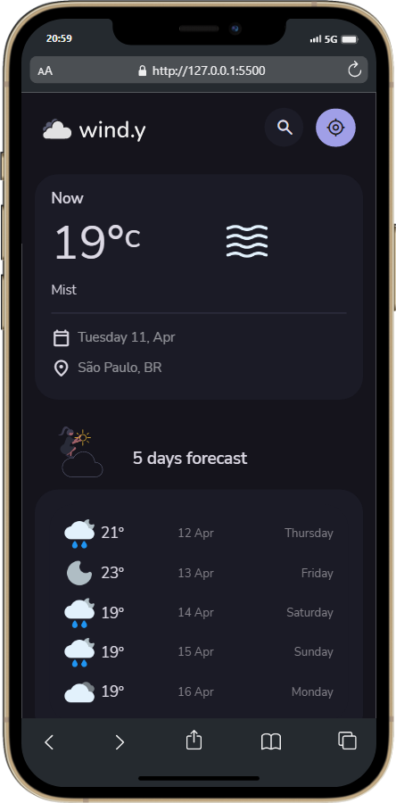

<h1 align="center">

</h1>
 

<h3 align="center">
🌧 Preview - (Desktop)
</h3>

 
 

<h3 align="center">
🌧 Preview - Mobile e Tablet
</h3>
 

&ensp; &ensp; &ensp; &ensp; &ensp; &ensp; &ensp; &ensp; &ensp; &ensp; &ensp; &ensp; &ensp; &ensp;  &ensp; &ensp; &ensp; 
 
 

## ⛅️ Sobre

> É um projeto de uma aplicação para consultar as condições climáticas globalmente e está 100% responsivo. É um outro trabalho que será utilizado no meu portfólio, tive algumas dificuldades mas o importante é que no final deu certo e aprendi coisas novas. 
O app oferece informações detalhadas e atualizadas sobre as condições climáticas das regiões, para que ajude as pessoas a planejarem seu dia com facilidade e também conta com a opção de ''ligar'' a localização do usuário. Eu utilizei OpenWeather API, na qual me ajudou bastante a entender como é feito a integração de uma API nos sites.

 

## 🌨 Seções
O site é possui cinco partes:

- **Current Weather:** Nessa parte mostra como está o clima atualmente em determinada região.
- **Forecast:** Mostra a previsão do clima em 5 dias.
- **Today's Highlights:** Informações detalhadas sobre o dia, como a qualidade do ar, humidade, nascer e pôr do sol, pressão, visibilidade e sensação térmica.
- **Hourly Forecast:** Apresenta como o clima e a velocidade do vento irão se comportar ao longo do dia.
- **Error 404:** Também possui uma tela personalizada para caso a página não for encontrada.
 

---

## 🌩 Tecnologias utilizadas:

Para o desenvolvimento deste site utilizei as seguintes tecnologias:

* HTML
* Sass
* JavaScript
* OpenWeather API

---

## 🎐 Licença
Esse projeto está sob licença. Clique no arquivo [LICENÇA](https://github.com/larisn/larisn/blob/main/LICENSE2.md) para ver mais detalhes.

 

---

Feito com 🖤 by larisn
